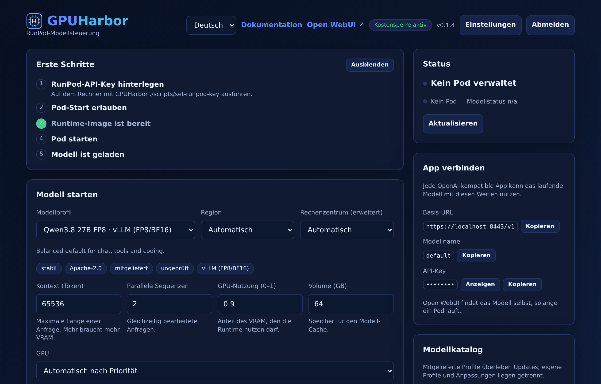

# GPUHarbor

[](https://github.com/lightcr1/gpuharbor/actions/workflows/ci.yml)
[](https://github.com/lightcr1/gpuharbor/releases)
[](LICENSE)

Eine kleine Steuerzentrale, um KI-Modelle auf RunPod laufen zu lassen. GPUHarbor
verwaltet einen GPU-Pod, lädt ein Modell und stellt es über eine
OpenAI-kompatible API bereit.

```
Browser -> GPUHarbor -> RunPod-Pod -> Runtime-Image -> Modell
```

Der Controller läuft überall, wo Docker läuft, und braucht keine GPU. Nur der
Pod kostet Geld.



Nicht mit RunPod verbunden und nicht von RunPod betrieben.

## Was es macht

- Einen Pod starten und stoppen, mit standardmäßig aktiver Kostensperre.
- Modellprofile auf der Platte speichern und im Browser bearbeiten. Updates
  bringen neue Profile, deine eigenen bleiben unberührt.
- GPUs aus dem echten RunPod-Katalog wählen, oder einfach eine Region angeben
  und das Rechenzentrum automatisch zuweisen lassen.
- Die genaue RunPod-Anfrage vorher ansehen, mit entfernten Geheimnissen.
- Das Modell jedem OpenAI-kompatiblen Client bereitstellen. Das Dashboard zeigt
  Basis-URL, Modellname und Key zum Kopieren.
- Open WebUI und OpenHands nach Wunsch dazunehmen. Beide sind automatisch mit
  deinen Modellen verbunden: Open WebUI findet das laufende Modell selbst, und
  OpenHands bekommt für jedes Modell ein fertiges Profil.
- HTTPS als Standard, und ein Befehl zur Fehlersuche (`./scripts/doctor`).

## Installation

Du brauchst Docker mit Compose und einen [RunPod](https://www.runpod.io/)-Account
(nur zum Starten echter Pods; das Dashboard läuft auch ohne).

```bash
git clone https://github.com/lightcr1/gpuharbor.git
cd gpuharbor
./scripts/install
```

Der Installer prüft Docker, erzeugt Passwörter und ein lokales Zertifikat, startet
alles und wartet, bis es antwortet. Danach:

1. `https://localhost:8443` öffnen, Benutzer `admin`. Passwort anzeigen mit
   `./scripts/init-env --show-login`.
2. Der Browser warnt vor dem Zertifikat, bis er der lokalen CA vertraut. Der
   Installer bietet an, das für dich zu erledigen (oder `./scripts/trust-ca`).
3. Die **Erste-Schritte-Checkliste** im Dashboard abarbeiten: RunPod-Key hinterlegen
   (`./scripts/set-runpod-key`), Modell wählen, Pod starten.

Mit `--webui` und/oder `--openhands` kommen die Apps dazu. Etwas funktioniert nicht?
`./scripts/doctor` ausführen. Für LAN oder die interaktive Variante siehe
[Setup](docs/SETUP.md). Die App erklärt jedes Feld unter `/docs`.

Nichts an RunPod passiert, solange `RUNPOD_ALLOW_BILLABLE_ACTIONS=false` gesetzt
ist.

## Modellprofile

Vier Profile sind dabei:

| Profil | Runtime | Stand |
|---|---|---|
| Qwen3.8 27B FP8 | vLLM | lief auf einer A40 |
| Qwen3 Coder 30B FP8 | vLLM | noch nicht auf GPU getestet |
| HauhauCS 35B Aggressive Q6 | llama.cpp | noch nicht auf GPU getestet |
| Ternary Bonsai 2 27B PTQ1_0 | Bonsai-Fork | noch nicht auf GPU getestet |

Die Modellgewichte lädt der Pod beim ersten Start und legt sie auf seinem Volume
ab. GPUHarbor verteilt sie nicht. Siehe [Models](docs/MODELS.md) und
[Third-party components](docs/THIRD_PARTY.md).

## Dokumentation

[docs/](docs/README.md) enthält Setup, Modelle, Upgrades, Status und die
Sicherheitsrichtlinie. [docs/STATUS.md](docs/STATUS.md) sagt offen, was getestet
ist und was nicht.

## Lizenz

Apache-2.0 für den offenen Kern, siehe [LICENSE](LICENSE). Geplante bezahlte
Funktionen (mehrere Anbieter, Teams, Kostenautomatik) sind ein getrenntes,
geschlossenes Modul und nicht in diesem Repository.
[docs/LICENSING.md](docs/LICENSING.md) erklärt die Aufteilung.
