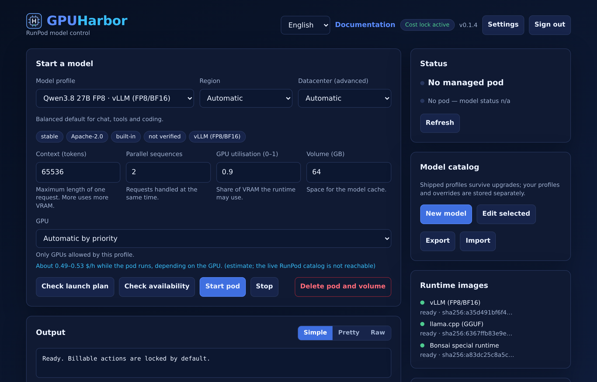

# GPUHarbor

[](https://github.com/lightcr1/gpuharbor/actions/workflows/ci.yml)
[](https://github.com/lightcr1/gpuharbor/releases)
[](LICENSE)

A small control panel for running AI models on RunPod. It manages one GPU pod,
loads a model, and exposes it through an OpenAI-compatible API.

```
Browser -> GPUHarbor -> RunPod pod -> runtime image -> model
```

The controller runs anywhere Docker runs and needs no GPU. Only the pod costs
money.



Not affiliated with RunPod.

## What it does

- Start and stop one pod, with a cost lock that is on by default.
- Keep model profiles on disk and edit them in the browser. New versions of
  GPUHarbor add profiles without touching yours.
- Pick GPUs from the live RunPod catalog, or just choose a region and let it
  pick a datacenter.
- Preview the exact RunPod request, with secrets removed, before spending
  anything.
- Serve the model to any OpenAI-compatible client. The dashboard shows the base
  URL, model name and key to copy.
- Add Open WebUI, OpenHands, both, or neither. Both are connected to your models
  automatically: Open WebUI finds the running model by itself, and OpenHands gets a
  ready-made profile for every model.
- Use the models in the PI coding agent with one command: `./scripts/connect-pi`.
- HTTPS by default, with a one-command check (`./scripts/doctor`) when something
  does not work.

## Install

You need Docker with Compose and a [RunPod](https://www.runpod.io/) account (only
for starting real pods; the dashboard works without one).

```bash
git clone https://github.com/lightcr1/gpuharbor.git
cd gpuharbor
./scripts/install
```

The installer checks Docker, creates secrets and a local certificate, starts
everything and waits until it answers. Then:

1. Open `https://localhost:8443`, user `admin`. Show the password with
   `./scripts/init-env --show-login`.
2. Your browser warns about the certificate until it trusts the local CA. The
   installer offers to do that for you (or run `./scripts/trust-ca`).
3. Follow the **Getting started** checklist in the dashboard: store your RunPod key
   (`./scripts/set-runpod-key`), pick a model, start a pod.

Add `--webui` and/or `--openhands` to the install command for the apps. Something
not working? Run `./scripts/doctor`. For a LAN or the interactive variant see
[Setup](docs/SETUP.md). The app explains every field at `/docs`.

Nothing touches RunPod until you set `RUNPOD_ALLOW_BILLABLE_ACTIONS=true`.

## Model profiles

Four profiles ship with the project:

| Profile | Runtime | Status |
|---|---|---|
| Qwen3.8 27B FP8 | vLLM | ran on an A40 |
| Qwen3 Coder 30B FP8 | vLLM | not tested on a GPU |
| HauhauCS 35B Aggressive Q6 | llama.cpp | not tested on a GPU |
| Ternary Bonsai 2 27B PTQ1_0 | Bonsai fork | not tested on a GPU |

Model weights are downloaded by the pod on first start and cached on its volume.
GPUHarbor does not redistribute them. See [Models](docs/MODELS.md) and
[Third-party components](docs/THIRD_PARTY.md).

## Documentation

[docs/](docs/README.md) has setup, models, upgrades, status and the security
policy. [docs/STATUS.md](docs/STATUS.md) is honest about what has and has not
been tested.

## License

Apache-2.0 for the open core, see [LICENSE](LICENSE). Planned paid features
(multiple providers, teams, cost automation) are a separate, closed component and
are not in this repository. [docs/LICENSING.md](docs/LICENSING.md) explains the
split.
