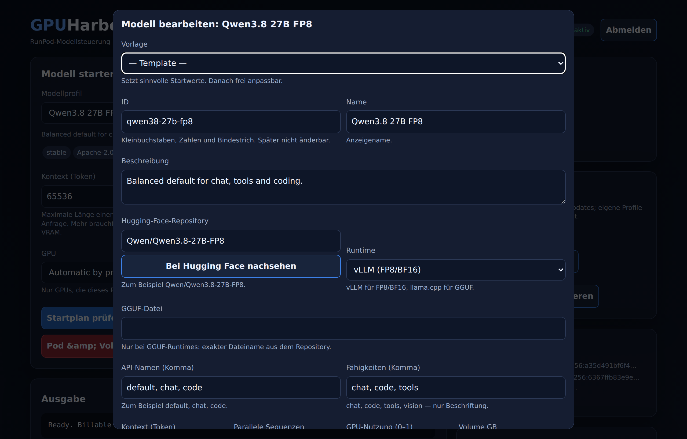

# Models

A model profile says which Hugging Face repository to load, which runtime serves
it, and what defaults to use. The weights are not part of GPUHarbor; the pod
downloads them on first start and caches them on its volume.

## Where profiles live

| File | Owner | What happens on upgrade |
|---|---|---|
| `registry/models.json` in the image | GPUHarbor | replaced when the image updates |
| `/data/user-models.json` | you | never replaced |
| `/data/user-models.json.bak` | GPUHarbor | previous version |
| `/data/models.json.migrated` | migration | old file kept as-is |

Editing a shipped profile stores an override. New shipped profiles appear after
an update. Removing a shipped profile that you had edited keeps the override
around as `orphaned-override` instead of deleting it. Details in
[UPGRADES.md](UPGRADES.md).

## Adding a model

In the dashboard: **New model**, pick a template, fill in the repository, save.
If you paste a repository and press **Look up on Hugging Face**, GPUHarbor reads
the model card and `config.json` and proposes the runtime, a context length, a
volume size, the license and suitable GPUs. GGUF repositories also get their
filename list. Nothing is saved until you press Save.

The important fields:

- **Runtime** — `vllm` for safetensors (FP8/BF16), `llama-cpp` for GGUF files,
  `bonsai` for the experimental ternary fork.
- **GGUF file** — only for GGUF runtimes, and it must be the exact filename from
  the repository.
- **Served names** — the names the API answers to, for example `default, chat`.
- **Context and sequences** — bigger means more VRAM.
- **Allowed GPUs** — the GPUs this profile may start on.
- **Volume** — has to be bigger than the model plus some headroom.

Save a new profile as `experimental` and `verified: false` until it has really
run on a GPU.

## vLLM options

These only apply to the `vllm` runtime.

- **Trust remote code** — runs `modeling_*.py` from the model repository on the
  pod. Some models need it. Only enable it for repositories you trust.
- **Reasoning parser (qwen3)** — splits the model's thinking into the
  `reasoning` field instead of the answer text.
- **Tool parser and auto tool choice (qwen3_coder)** — lets the model emit
  function calls in the OpenAI format. Needed for agents.

## VRAM

Rough guide: FP8 or BF16 needs about 1.3 times the model size, plus the KV cache.
A 27B FP8 model is around 31 GB and fits on a 48 GB card. Quantised GGUF is
smaller, but context still costs VRAM.

CUDA matters too. Older runtime images built on CUDA 12.x do not reliably run on
cards that expect CUDA 13, such as Blackwell.

## Runtime images

Runtime images are not editable in the browser on purpose: a free choice of image
would mean arbitrary code execution on the pod. They live in `runtime/`, and their
digests go into `.env`. See [STATUS.md](STATUS.md).

To add a runtime you need three things: an entry in `registry/runtimes.json`, a
Dockerfile under `runtime/`, and the image digest in `.env`. A genuinely new
backend (not vLLM, llama.cpp or Bonsai) also needs code in `runtime/gateway.py`.
